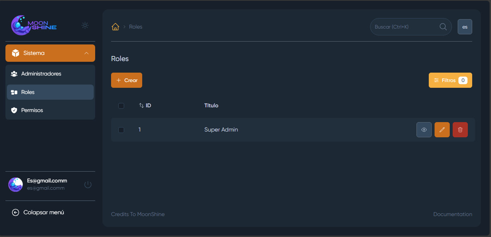
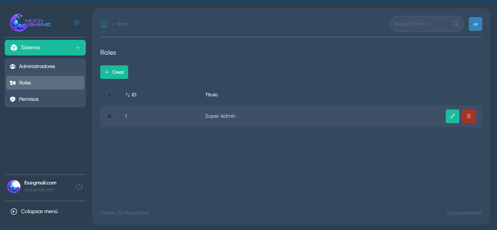

# Moonshine Boilerplate 🚀

Boilerplate personalizable para iniciar el desarrollo de su panel de administración con [Moonshine](https://moonshine-laravel.com/), un paquete de panel de administración potente y flexible para Laravel.


## Características 🌙

- Configuración predeterminada de **Moonshine**.
- Integración de permisos basados en roles utilizando el paquete [moonshine-roles-permissions](https://github.com/SWEET1S/moonshine-roles-permissions).
- Tres temas de colores predefinidos.
- Soporte para idioma español integrado.
- Comando para generar todos los permisos de los recursos.

## Themes





Package | Version
--- | ---
Laravel | v11
MoonShine  | v3
moonshine-roles-permissions | v3

## Instalación
Así es como puedes ejecutar el proyecto localmente:

1. Clona el repositorio
    ```sh
    git clone https://github.com/estivenm0/moonshine-boilerplate.git
    ```

2. Navega al directorio raíz del proyecto
    ```sh
    cd moonshine-boilerplate
    ```

3. Copia el archivo `.env.example` a `.env`
    ```sh
    cp .env.example .env
    ```


4. Instala las dependencias
    ```sh
    composer install
    ```

5. Genera la clave de la aplicación
    ```sh
    php artisan key:generate
    ```

6. Ejecuta las migraciones
    ```sh
    php artisan migrate
    ```

7. instala el paquete de permisos
    ```sh
    php artisan moonshine-rbac:install
    ```

8. Crea un Usuario
    ```sh
    php artisan moonshine-rbac:user
    ```